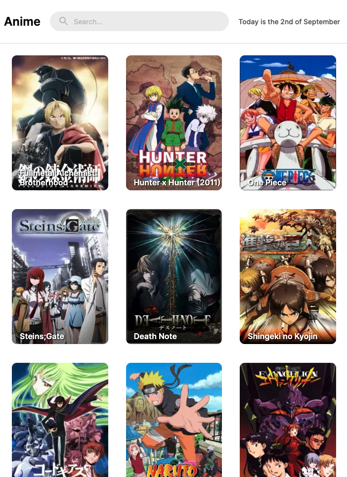
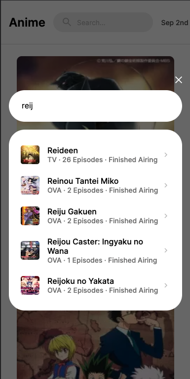
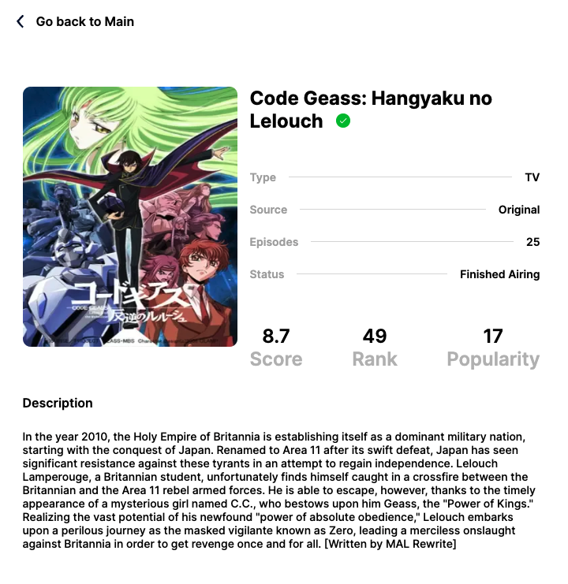

## COINABLE ANIME CHALLENGE

Thanks for this opportunity and let me show some of my pasion.

Vercel Deploy: [https://anime-coinable.vercel.app/](https://anime-coinable.vercel.app/) 👀

This is a [Next.js](https://nextjs.org/) project bootstrapped with [`create-next-app`](https://github.com/vercel/next.js/tree/canary/packages/create-next-app).

## Getting Started

First, after clone this repo, run the development server:

```bash
yarn
# and
yarn dev
```
//Use .env.example for variables.

Open [http://localhost:3000](http://localhost:3000) with your browser to see the magic.

#### 💻 Available Scripts

In the project directory, you can run:

- `yarn` (Install all dependencies)
- `yarn dev` (Runs the app in the development mode.)
- `yarn test` (Runs the tests above app.)
- `yarn test:coverage` (Runs the tests above app and get a coverage report.)

- Node Version: v18.8.0
- Yarn Version: v1.22.10

This site was inspired at Figma to [ANIME](https://www.figma.com/file/1gpzjPsFhEhXnAIkdAXEzI/Coinable's-Technical-Assignment?node-id=0%3A1) - In [NEXTJS](https://nextjs.org/)

#### Inspirations 🤯 🧠

- 🌈 🌎 Vitto 🌎 🏹
- FaztWeb: [FaztWeb](https://www.faztweb.com/)
- Simon Grimm: [Simon Grimm - Youtube](https://www.youtube.com/channel/UCZZPgUIorPao48a1tBYSDgg)
- Feranndo Herrera: [Ferando Herrera - Youtube](https://www.youtube.com/c/FernandoHerreraCr)
- Midudev: [midudev - Youtube](https://www.youtube.com/channel/UC8LeXCWOalN8SxlrPcG-PaQ)

### Tools 🧩

- VSCode: [https://code.visualstudio.com/](https://code.visualstudio.com/)
- Postman: [https://www.postman.com/](https://www.postman.com/)
- Next.js: [https://nextjs.org/](https://nextjs.org/)
- Jest: [https://jestjs.io/](https://jestjs.io/)
- Redux: [https://redux.js.org/](https://redux.js.org/)
- StackOverflow: [https://stackoverflow.com/ 😅](https://stackoverflow.com/ 😅)
- OSX Macbook

Sebastian Roger Loguzzo! 🌎

#### 💻 Screenshots





## Learn More about NextJs

To learn more about Next.js, take a look at the following resources:

- [Next.js Documentation](https://nextjs.org/docs) - learn about Next.js features and API.
- [Learn Next.js](https://nextjs.org/learn) - an interactive Next.js tutorial.

You can check out [the Next.js GitHub repository](https://github.com/vercel/next.js/) - your feedback and contributions are welcome!
